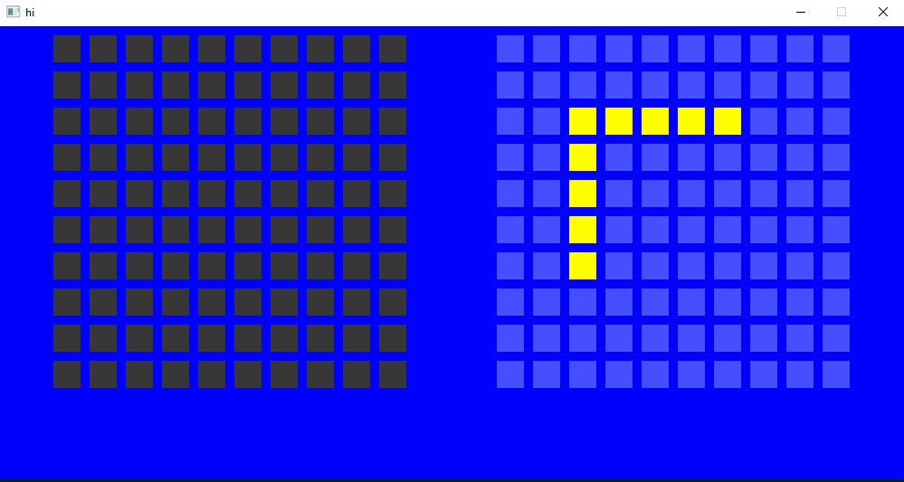
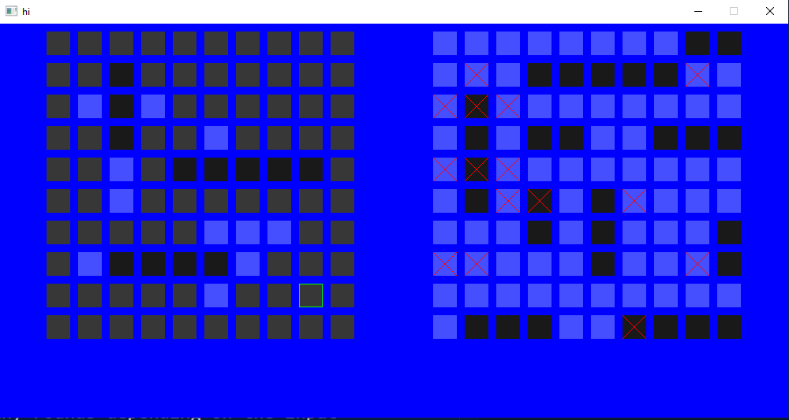

# Battleships

## Requirements and build process
In order to build the battleships executable you need:
* [SDL2](https://github.com/libsdl-org/SDL)
For this you can use a package manager. I installed SDL2 via [vcpkg](https://vcpkg.io/en/).
If you use vcpkg make sure to link it properly to the project. I recommend using a preset file.
To build the the project go to the battleships folder and type the following statements into the command line:
```
cmake -S . -B build
cmake --build build
```
These statements do not take into account if you are using a preset file.
For more information on preset files with vcpkg click [here](https://learn.microsoft.com/de-de/vcpkg/users/buildsystems/cmake-integration).
When you are done with the build process on Windows you can use the following command to play:
```
./build/bin/Debug/Battleships
```


## How to play
Right now you can only play against the a very dumb computer (His moves are chosen at random).
The game is divided into two phases. The preperation phase and the blowing up ships phase.
In the preperation phase you can navigate the board using your arrow keys. To place a ship you can hit enter and choose a directory in which the ship should point. You can do that by using your arrow keys again. Possible options are highlighted with yellow. Once done with placing down all your ships you and the computer take turns in the blowing up ships phase. You'll get another turn when you hit something.

### Keybindings
* Arrow-Up: Up.
* Arrow-Down: Down.
* Arrow-Left: Left.
* Arrow-Right: Right.
* R: Reset your current ship placement.
* Z: Random ship placement, in case you are lazy.
* V: Uncovers the board of the enemey. For debugging purposes.
* ESC: Exit game (without warning).

Have fun blowing up ships!

### Gallery

Picture of placing down ships.


Picture of blowing up ships.
